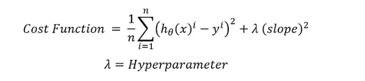
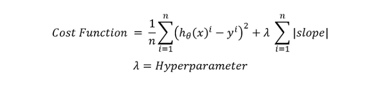
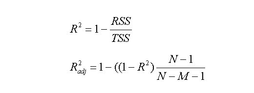

## Ridge regression (L2 Regularisation or L2 norm)?

 ridge regression adds a parameter to the linear regression cost function to avoid overfitting so the cost function of ridge regression looks like this:

## Lasso Regression (L1 NOrm or L1 Regularisation)?

## R2 Score?
R-squared, also known as the __coefficient determination__, defines the degree to which the variance in the dependent variable (or target) can be explained by the independent variable (features).

## Drawback of R2 score?
One drawback of r-squared is that it assumes every variable helps in explaining the variation in the target, which might not always be true. For instance, if we add a new features to the data (which may or may not be useful), the r-squared value for the model would either increase or remain same but it would never decrease.This is taken care of by a slightly modified version of r-squared, called the adjusted r-squared.

## Adjusted R-square
Similar to R-squared, the Adjusted R-squared measures the variation in the dependent variable (or target), explained by only the features which are helpful in making predictions. Unlike R-squared, the Adjusted R-squared would penalize you for adding features which are not useful for predicting the target.

Numr-  Sum of Squared Residuals
Denr- The Total Sum of Squares

