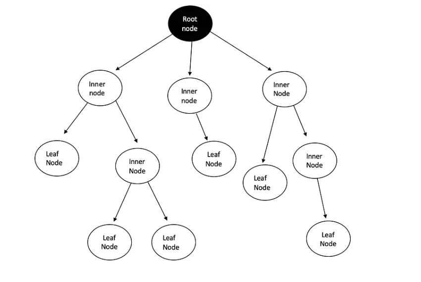
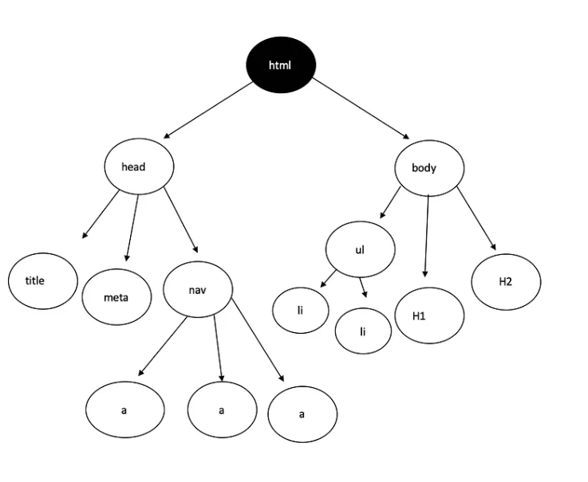
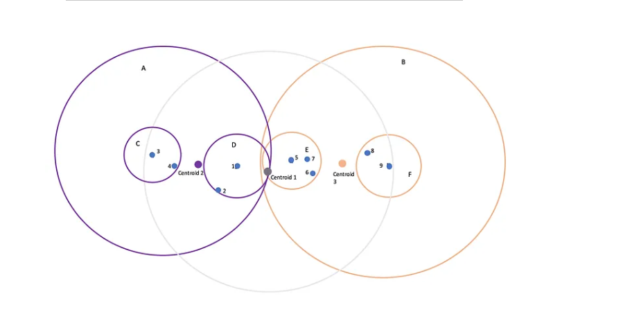
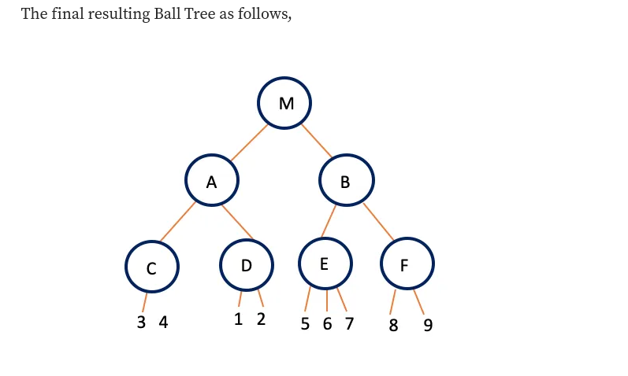

## We know that k-NN classifier is a brute force approach which turns out to be a lazy learner. Are ther any better approaches?

__k-Dimensional Tree (kd tree)__

k-d tree is a hierarchical binary tree. When this algorithm is used for k-NN classficaition, it rearranges the whole dataset in a binary tree structure, so that when test data is provided, it would give out the result by traversing through the tree, which takes less time than brute search.

it is just like a html language herirarcy

__Ball Tree__

Similar to k-d trees, Ball trees are also hierarchical data structure. These are very efficient specially in case of higher dimensions.

a) Two clusters are created initially

b) All the data points must belong to atleast one of the clusters.

c) One point cannot be in both clusters.

d) Distance of the point is calculated from the centroid of the each cluster. The point closer to the centroid goes into that particular cluster.

e) Each cluster is then divided into sub clusters again, and then the points are classified into each cluster on the basis of distance from centroid.

f) This is how the clusters are kept to be divided till a certain depth.

Brute Force may be the most accurate method due to the consideration of all data points. Hence, no data point is assigned to a false cluster. For small data sets, Brute Force is justifiable, however, for increasing data the KD or Ball Tree is better alternatives due to their speed and efficiency.