## What is the moto of the svm algorithm?

The objective of the support vector machine algorithm is to find a hyperplane in an N-dimensional space(N — the number of features) that distinctly classifies the data points. Our objective is to find a plane that has the maximum margin, i.e the maximum distance between data points of both classes.

## what are support vectors in the svm?
Support vectors are data points that are closer to the hyperplane and influence the position and orientation of the hyperplane. Using these support vectors, we maximize the margin of the classifier. Deleting the support vectors will change the position of the hyperplane. These are the points that help us build our SVM.

## Differentiate between Svm and Logistic regression margin intuition?

In logistic regression, we take the output of the linear function and squash the value within the range of [0,1] using the sigmoid function. If the squashed value is greater than a threshold value(0.5) we assign it a label 1, else we assign it a label 0. In SVM, we take the output of the linear function and if that output is greater than 1, we identify it with one class and if the output is -1, we identify is with another class. Since the threshold values are changed to 1 and -1 in SVM, we obtain this reinforcement range of values([-1,1]) which acts as margin.

we choose the hyperplane at that point where we have the maximum margiin

## Main idea behind support vector machine/

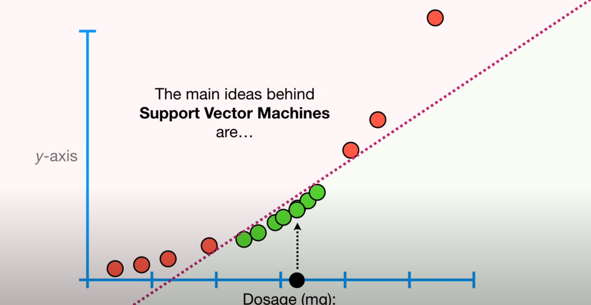

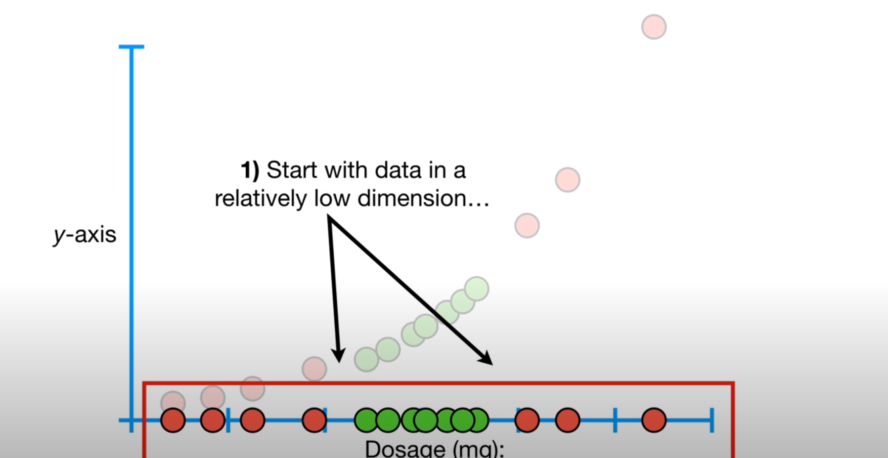

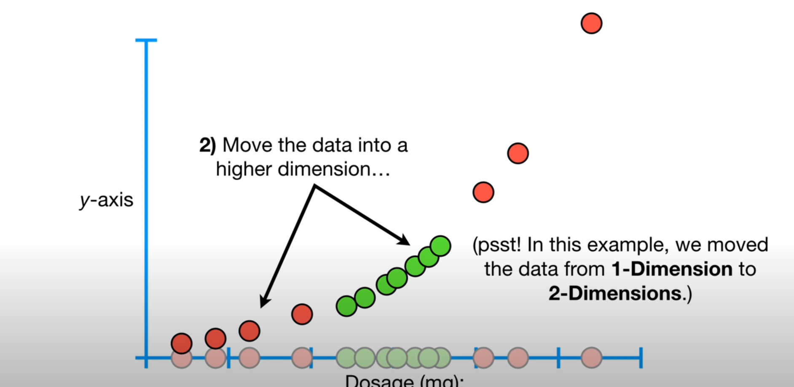

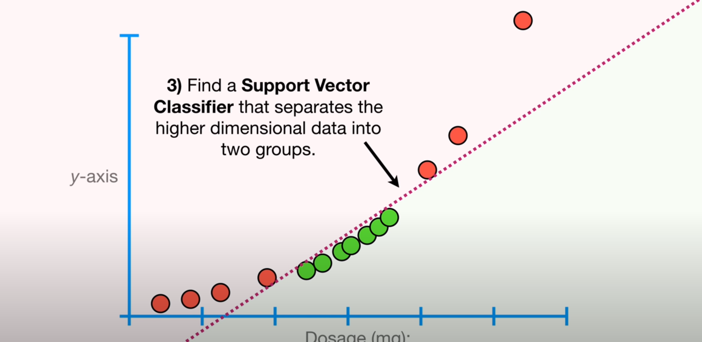

## How do svm decides how to transform the data and define kernala and its types?

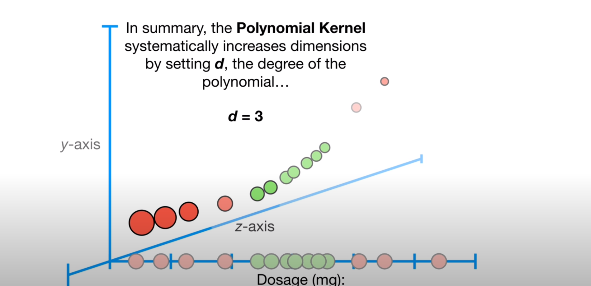

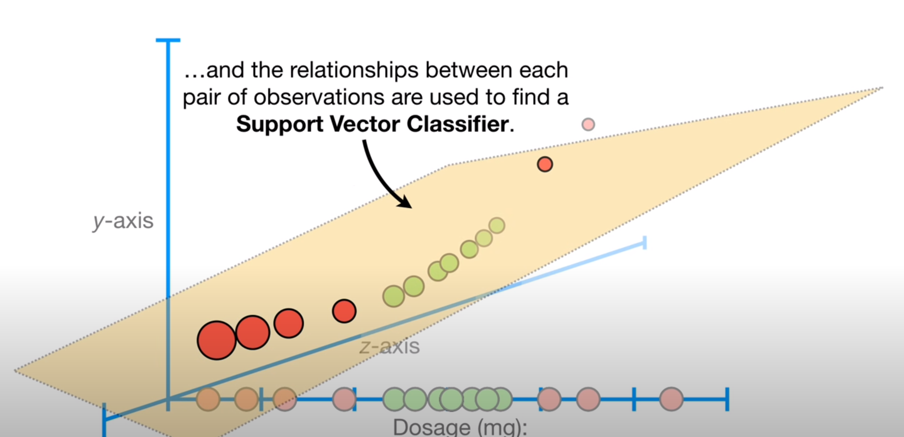

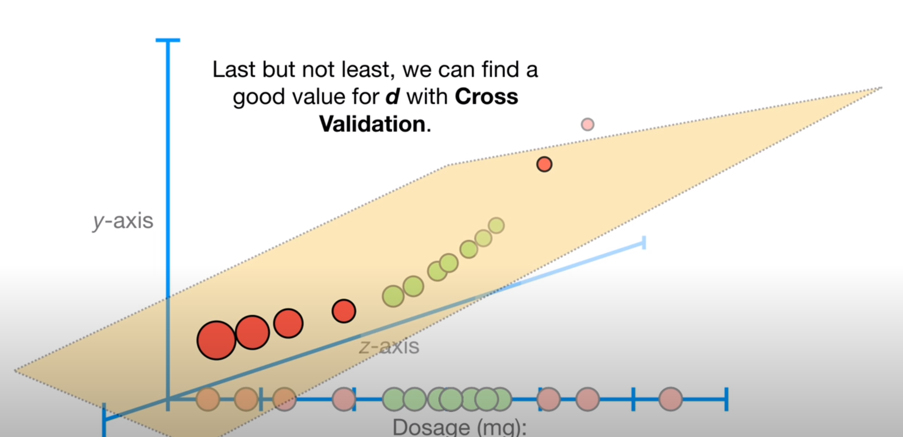

another very commonly used kernek is the Radical Kernel also Known as Radical Basis Function (RBF) Kernel.

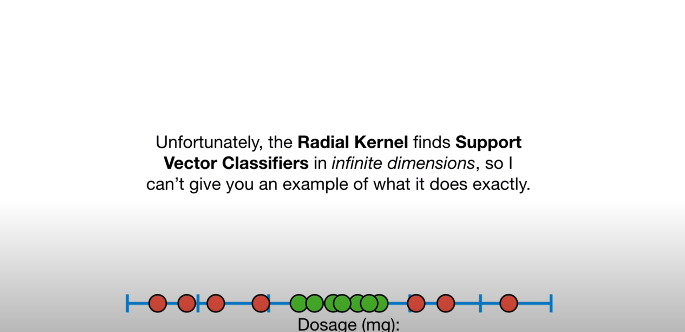

## Define the Kernel Trick?

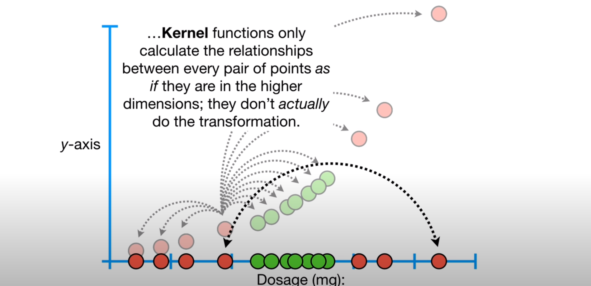

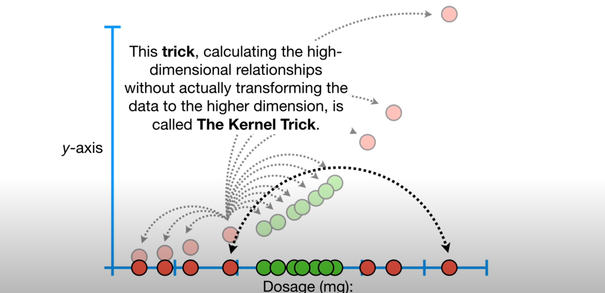

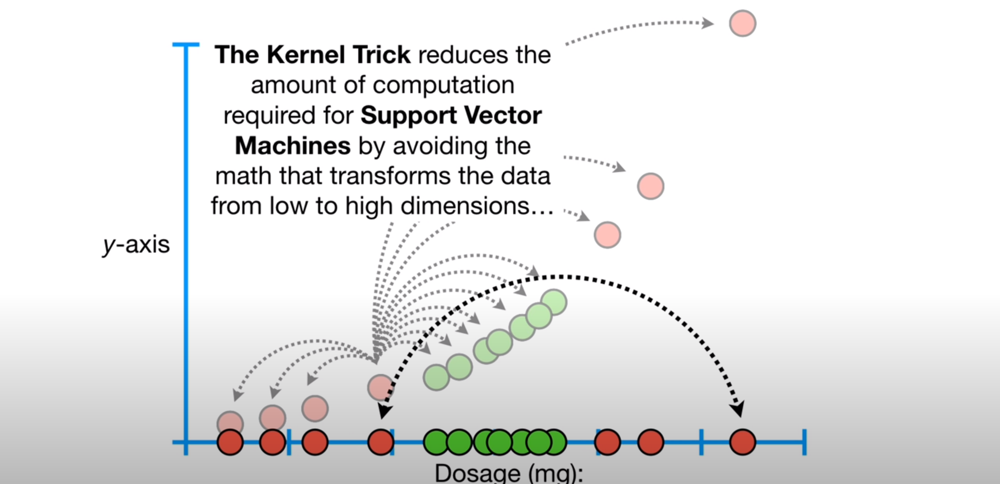

## What is  a hyperplane?
 When data are in 4 or more dimensions the support vector classifers are a hyperplane.
 1D-point
 2d-Line
 3d -   2d-plane 