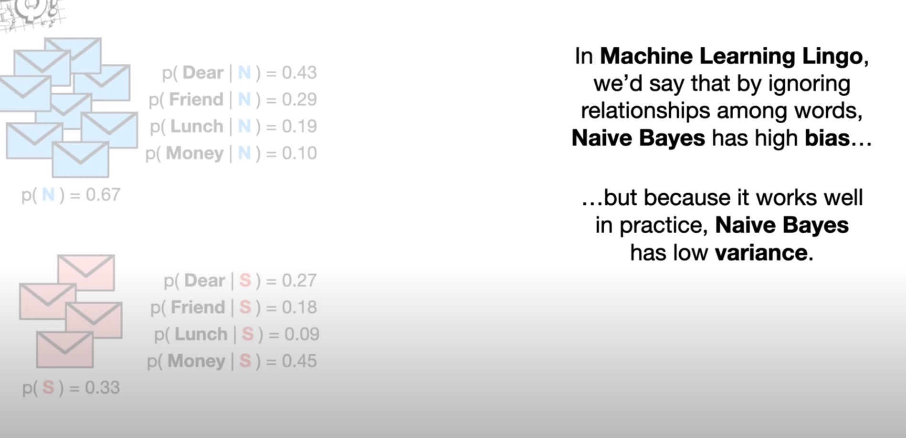

## What is prior probability?

## Explain the working of Baive Bayes?

## Why does the word naive signifies here?
The term "naive" in "Naive Bayes" refers to the assumption that the features used to describe an observation are conditionally independent, given the class label.

